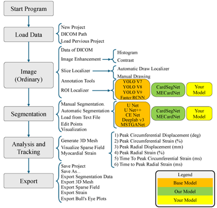
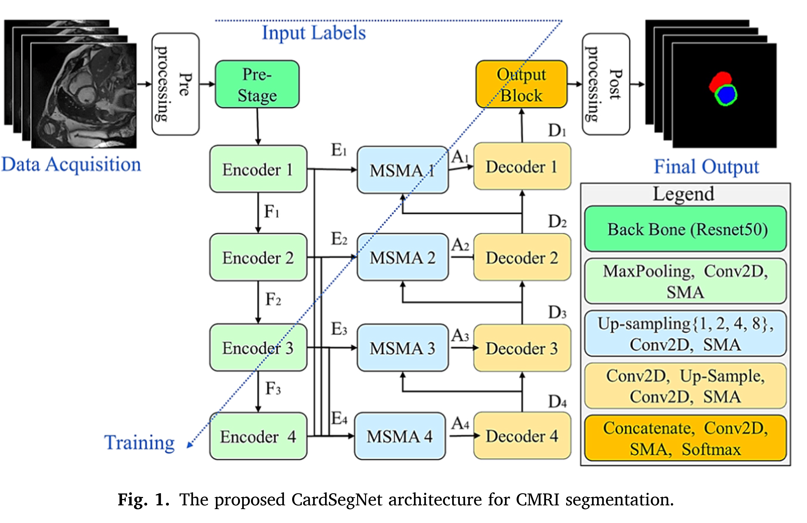
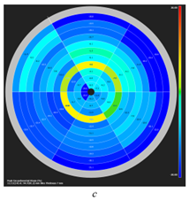
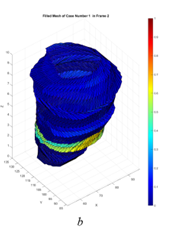
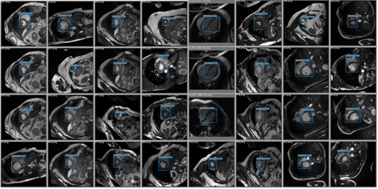
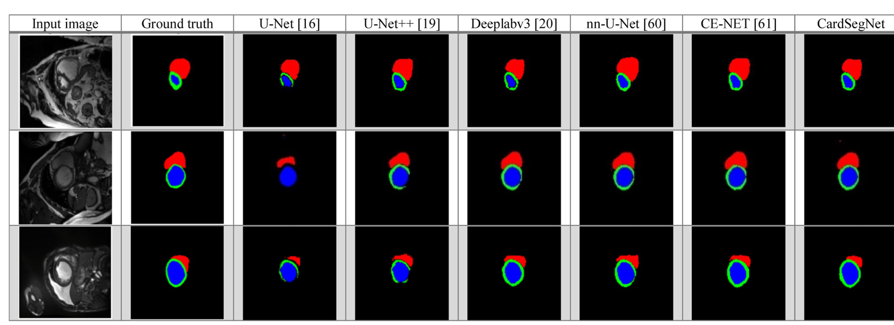
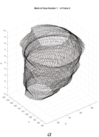

# 🔬 CMRI-Insight: Cardiac MRI Analysis Toolkit


## 📌 Overview
**CMRI-Insight** is an open-source Python-based toolkit for the automated **segmentation**, **motion tracking**, and **functional analysis** of Cardiac Magnetic Resonance Imaging (CMRI) data. With integrated deep learning models such as **CardSegNet** and **MECardNet**, it provides accurate delineation of the left ventricle (LV), right ventricle (RV), and myocardium (Myo), facilitating both research and clinical workflows.

The toolkit includes a **user-friendly GUI**, preprocessing scripts, segmentation pipelines, strain analysis modules, and AHA-compliant visualizations, helping accelerate CMRI data interpretation.

## 🧠 Key Features
- ✅ Deep learning-based cardiac segmentation (LV, RV, Myo)
- ✅ Motion tracking and myocardial strain analysis
- ✅ AHA-standard Bull’s-eye visualization
- ✅ 3D mesh reconstruction of myocardial structures
- ✅ Support for DICOM and NIfTI formats
- ✅ PyQt5-based GUI for ease of use
- ✅ Customizable segmentation models
- ✅ Machine-learning ready backend for advanced users

## ⚙️ Installation

### ✅ Prerequisites
- Python 3.8+
- pip
- Git

### 🔧 Setup Instructions
```bash
# Clone the repository
git clone https://github.com/Hamed-Aghapanah/CMRI-Insight.git
cd CMRI-Insight

# Install required packages
pip install -r requirements.txt
```
> 💡 For GPU acceleration, ensure proper installation of CUDA and a GPU-compatible version of TensorFlow or PyTorch.

## 🧪 Usage

### 🎛️ Launch GUI
```bash
python main.py
```

### 🛠️ Command-Line Interface (CLI)
```bash
python segment.py --input path/to/dicom --model CardSegNet
```

## 📂 Recommended Directory Structure
```
CMRI-Insight/
├── cmri_insight/         # Core application logic
│   ├── gui/              # GUI components (PyQt5)
│   ├── models/           # DL models (CardSegNet, MECardNet)
│   ├── utils/            # Helper functions
│   └── analysis/         # Strain and function analysis
├── data/                 # Sample/test datasets
├── images/               # Screenshots and visual assets
├── scripts/              # Pre/postprocessing scripts
├── supplementary/        # Results, metrics, figures
├── LICENSE
├── README.md
└── requirements.txt
```

## 📦 Sample Data
We provide de-identified sample CMRI datasets:
- `data/sample_dicom/`: Example DICOM series
- `data/sample_nifti/`: Converted NIfTI versions
- `supplementary/validation_results/`: Metrics (Dice, Jaccard, Hausdorff)

> 🔗 For full datasets, see [UK Biobank](https://www.ukbiobank.ac.uk/) or contact the authors.

## 📚 Documentation
Comprehensive documentation and usage tutorials are available on our [Wiki](https://github.com/Hamed-Aghapanah/CMRI-Insight/wiki).

## 📬 Contact
- **Hamed Aghapanah**  
📧 [h.aghapanah@amt.mui.ac.ir](mailto:h.aghapanah@amt.mui.ac.ir)  
👨‍💻 [GitHub Profile](https://github.com/Hamed-Aghapanah)

## 📝 Citation
If you use this toolkit in your research, please cite:

```bibtex
@article{aghapanah2025cmri,
  title={CMRI Insight: A GUI-Based Open-Source Tool for Cardiac MRI Segmentation and Motion Tracking Application},
  author={Aghapanah, Hamed and Saeeidi Rad, Ali and Rabbani, Hossein and Kermani, Saeed and Arabi, Hossein},
  journal={SoftwareX},
  year={2025}
}
```

## 🛡️ License
Distributed under the **MIT License**. See the [LICENSE](LICENSE) file for details.

## 🤝 Contributing
We welcome contributions!  
Please:
1. Fork this repo
2. Create a branch (`git checkout -b feature/FeatureName`)
3. Commit your changes
4. Push the branch (`git push origin feature/FeatureName`)
5. Open a pull request

## ✅ Roadmap
- [ ] Support for multi-center dataset integration
- [ ] Real-time motion tracking during CMRI acquisition
- [ ] YOLOv9-based ROI localization
- [ ] Export to standard clinical report formats
- [ ] Expanded tutorials and API references

## 📎 Related Publications
- **CardSegNet** – [DOI link]
- **MECardNet** – [DOI link]
- **Cardiac MR Segmentation Benchmarks** – [DOI link]

## 🖼️ Figures from the Paper
### Overview Diagram


### Segmentation Pipeline


### Gui Screenshot


### Strain Analysis Output


### Bullseye Plot


### 3D Reconstruction


### Metrics Results

## 🖼️ Figures from the Paper
### Figure 1: Workflow of the CMRI Insight application: from data loading to export.


### Figure 2: Graphical User Interface showing cardiac segmentation views and controls.


### Figure 3: ROI identification using YOLOv7 on cardiac MRI series.


### Figure 4: Comparison of segmentation results: Manual vs CardSegNet vs MECardNet.


### Figure 5: 3D visualization of contours and Bull's-eye representation from CVI42.

