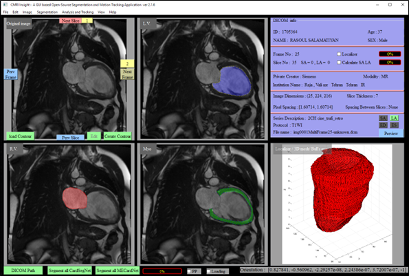

Here's a professional `README.md` in English for your CMRI-Insight GitHub repository:

```markdown
# CMRI-Insight: Cardiac MRI Analysis Toolkit

 <!-- Add a representative image if available -->

## Overview
CMRI-Insight is an advanced toolkit for processing and analyzing Cardiac Magnetic Resonance Imaging (CMRI) data. This repository provides tools for cardiac segmentation, functional analysis, and visualization of CMRI datasets.

## Key Features
- 🫀 Automated cardiac chamber segmentation
- 📊 Quantitative analysis of cardiac function
- 📈 Visualization tools for CMRI data
- 🏷️ Support for DICOM and NIfTI formats
- 🧠 Machine learning-ready pipeline

## Installation

### Prerequisites
- Python 3.8+
- pip package manager

### Installation Steps
```bash
git clone https://github.com/Hamed-Aghapanah/CMRI-Insight.git
cd CMRI-Insight
pip install -r requirements.txt
```

## Usage
```python
from cmri_insight import Processor

# Load and process CMRI data
processor = Processor('path/to/your/dicom/folder')
results = processor.analyze()
results.visualize()
```

## Documentation
For detailed documentation, please visit our [Wiki pages](https://github.com/Hamed-Aghapanah/CMRI-Insight/wiki).

## Dataset Structure
We recommend organizing your CMRI datasets as follows:
```
patient_data/
├── patient_01/
│   ├── DICOM/
│   └── annotations.xml
├── patient_02/
│   ├── DICOM/
│   └── annotations.xml
└── ...
```

## Contributing
We welcome contributions! Please follow these steps:
1. Fork the repository
2. Create your feature branch (`git checkout -b feature/AmazingFeature`)
3. Commit your changes (`git commit -m 'Add some AmazingFeature'`)
4. Push to the branch (`git push origin feature/AmazingFeature`)
5. Open a Pull Request

## License
Distributed under the MIT License. See `LICENSE` for more information.

## Contact
Hamed Aghapanah - [email@example.com](mailto:email@example.com)  
Project Link: [https://github.com/Hamed-Aghapanah/CMRI-Insight](https://github.com/Hamed-Aghapanah/CMRI-Insight)

## Acknowledgments
- [List any libraries or frameworks you used]
- [Inspiration from other projects]
```

**Recommendations to enhance your repository:**
1. Add a representative image in the `images/` folder
2. Include a `requirements.txt` file with all dependencies
3. Create a basic `LICENSE` file
4. Set up GitHub Wiki for documentation
5. Add GitHub badges (build status, Python version, etc.) if applicable

Would you like me to modify any specific section or add more details about particular functionality?
